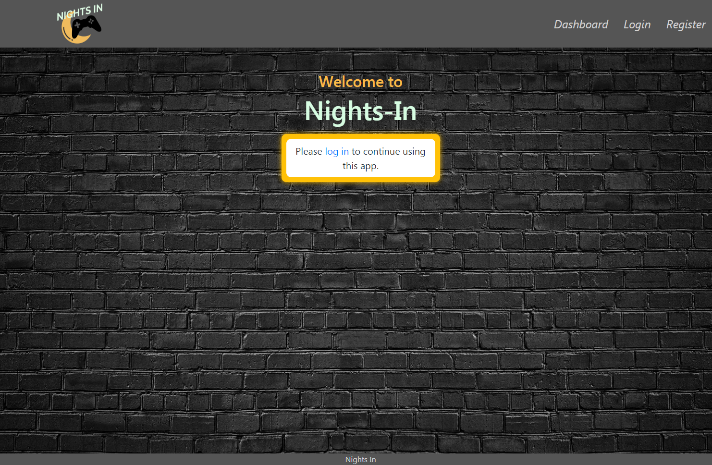

# Nights-In

[](https://opensource.org/licenses/ISC)

## Description

"Nights in" is an application that allows for a user to create an account and invite others to participate and compete in customizable trivia games.

## Table of Contents

- [Installation](#Installation)
- [Usage](#Usage)
- [Screenshot](#Screenshot)
- [Deployment](#Deployment)
- [License](#License)
- [Contributors](#Contributors)
- [Credits](#Credits)

## Installation

Install the application with

```
npm install
```

The provided [schema.sql](https://github.com/JFunck1990/Nights-In/blob/main/server/db/schema.sql) file should be used to create the initial database. Seed data will be loaded by Sequelize when the application is started.

## Usage

A MySQL database must be available, either locally or remotely. This application is designed to be deployed on Heroku with JawsDB for running MySQL. You may provide a full MySQL URL in the following environment variable:

```
JAWSDB_URL = full MySQL URL with username, password, host, database
```

or you may set values individually if you are working with a local database:

```
SEQUELIZE_USER = username for local database
SEQUELIZE_PASSWORD = password for user
SEQUELIZE_HOST = hostname of MySQL db (probably localhost)
```

The password encryption uses a salting system, so the secret value must be set via environment variable:

```
AUTH_SECRET = your SECRET salting
```

In order to initialize the database with seed data, the following environment variables must be set:

```
ADMIN_USER_PWD = password for example Admin user
FORCE_SYNC = true/false (true will overwrite the database with seed data every time the server is started)
```

The server can then be run with

```
npm start
```

## Screenshot



## Deployment

This application has been deployed on Heroku at https://nights-in.herokuapp.com/

## License

This application is covered under the **ISC** license. More info can be found here: [ISC](https://opensource.org/licenses/ISC)

## Contributors:

- [Jack Funck](https://github.com/JFunck1990) - Back-End Design, Javascript
- [Kate Milano](https://github.com/katemilano) - Front-end Design & JS
- [Zach Smith](https://github.com/zsmith4331) - Front-end Design, Styling
- [Matthew Randolph](https://github.com/RobeandHat) - Front-end Design, Styling
- [JP Grace](John-Paul-Grace) - Back-End Design, Javascript

## Credits

Starter code for server.js and user authentication provided as part of a project for the UNC Chapel Hill Coding Bootcamp.
